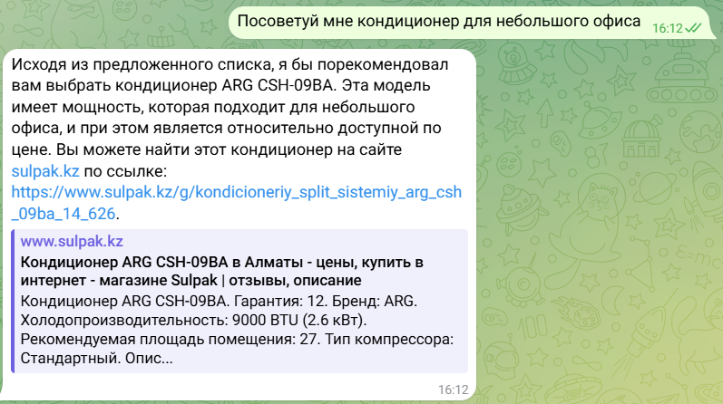

# SulpakBot

A Telegram bot that provides real-time product recommendations from Sulpak.com, tailored to specific user queries. This bot simplifies the shopping experience by helping users find the best products for their needs.

## Below is an example of how SulpakBot works in real-time.

**User Query:**
“Recommend me an air conditioner for a small office.”

**Bot Response:**
The bot analyzes the query and provides a tailored recommendation:

- Suggests the ARG CSH-09BA air conditioner, mentioning its suitability for small office spaces, affordability, and technical specifications like cooling capacity and area coverage.
- Provides a direct link to the product on Sulpak's website for further details and purchase.
- Includes summarized specifications, such as warranty, brand, cooling power, and recommended room size.

## Features
- Real-Time Recommendations: The bot fetches product information and delivers tailored suggestions based on user queries.
- Product Filtering: Ensures results are accurate, relevant, and based on user-defined criteria like price, category, and quality.
- Natural Language Processing: Handles user questions such as:

"What is the best cheap aircon for my bedroom?"
 "Recommend a gaming laptop within my budget."

## How It Works

- User Interaction: Users send queries to the bot through Telegram.

- Query Processing: The bot parses the input to understand user intent and product requirements.

- Sulpak Integration: Retrieves product data from Sulpak’s inventory in real-time.

- Recommendations: Provides the best-matching products directly in the chat.

## Technologies Used

- Telegram Bot API: To handle communication between the user and the bot.

- Python: For bot development and backend logic.

- Sulpak’s API/Website Scraping: To fetch real-time product data.

- Natural Language Processing (NLP): For parsing and understanding user queries.

## Engineering & Design

This bot was engineered, designed, and presented during my internship at Sulpak, one of Kazakhstan's largest retail companies. The project demonstrated:

- Proficiency in developing scalable chatbot solutions.

- Integration with real-time data sources.

- Application of user-focused design principles to create an intuitive experience.

## Possible Enhancements

- Expand support for additional product categories.

- Integrate with other e-commerce platforms.

- Enhance NLP capabilities for more complex queries.

## Acknowledgements

Sulpak: For providing the platform and resources during my internship.

Telegram API: For enabling seamless communication.
